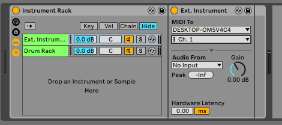
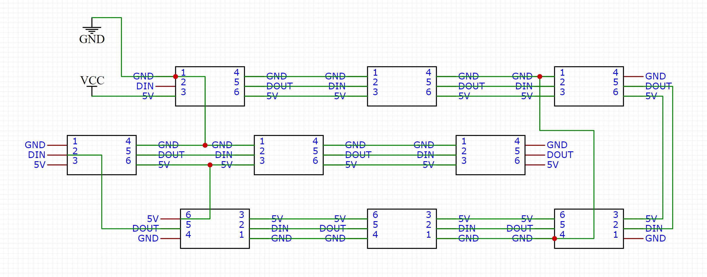
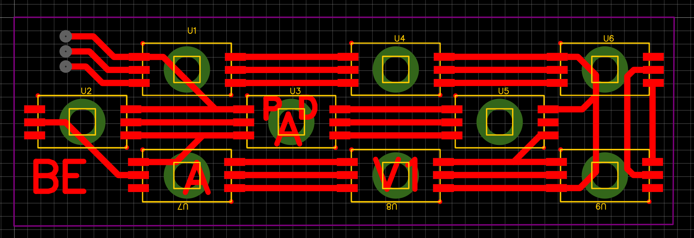
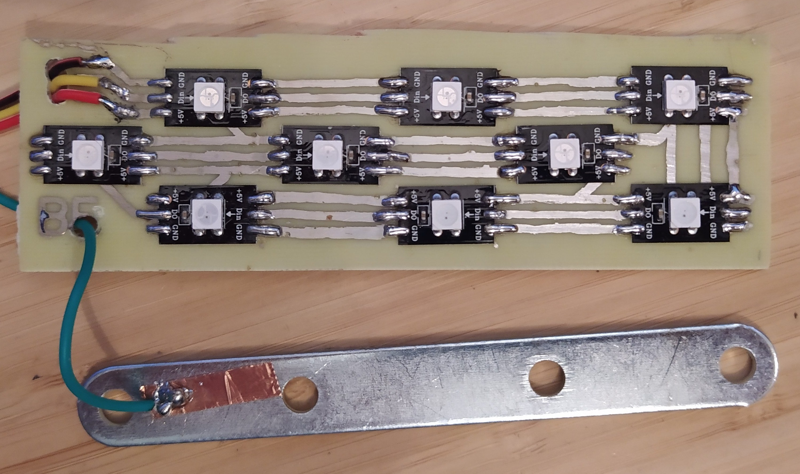
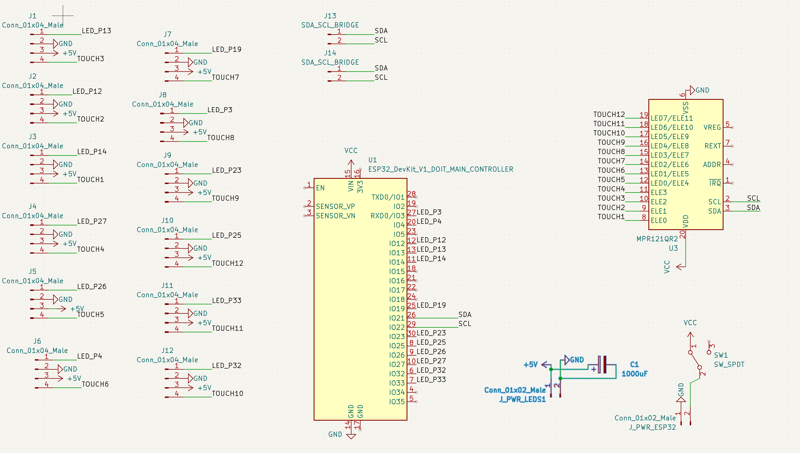
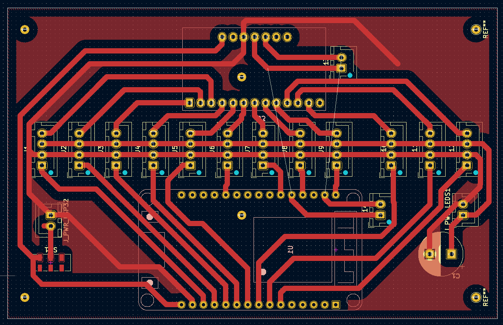
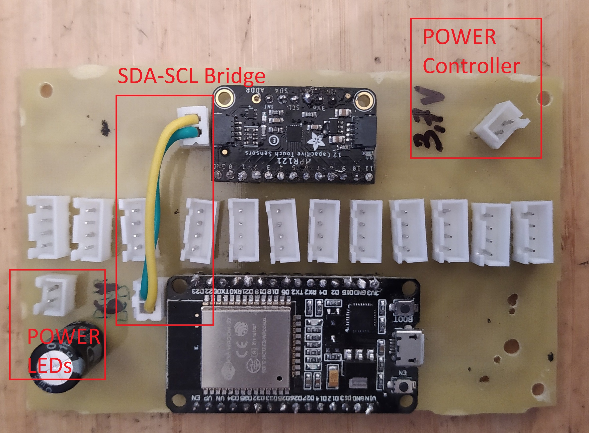
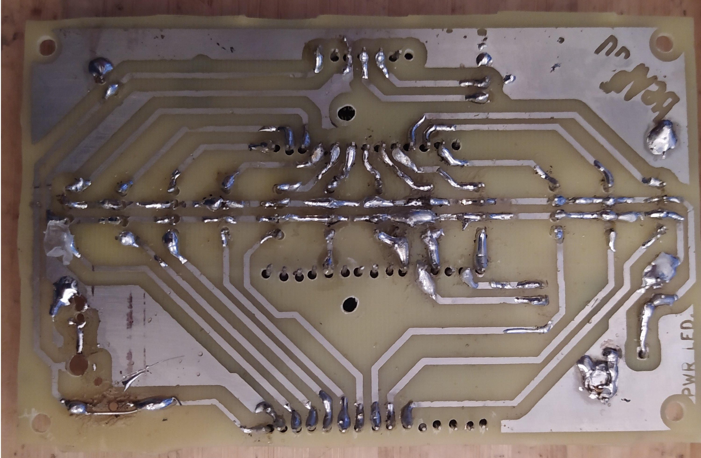

# BeAPad Led Project

Project for touch sensors combined to Neopixels and RTP Midi for controlling Light and music via midiMessages across wifi.

## Materials:

- ESP32 Microcontroller (WROOM
  DEVKIT_V1) [amazon](https://www.amazon.fr/SP-Cow-ESP-32S-d%C3%A9veloppement-Bluetooth-d%C3%A9nergie/dp/B07VJ34N2Q/ref=sr_1_5?__mk_fr_FR=%C3%85M%C3%85%C5%BD%C3%95%C3%91&crid=2QX1H1678O7M3&keywords=esp32+wroom+devkit&qid=1652459031&sprefix=esp32+wroom+devkit%2Caps%2C51&sr=8-5) [aliexpress](https://fr.aliexpress.com/item/1005001929935550.html?spm=a2g0o.search0304.0.0.a4b41103QWyj6D&algo_pvid=caa6f633-4206-442e-8846-f58ec6503b21&algo_exp_id=caa6f633-4206-442e-8846-f58ec6503b21-0&pdp_ext_f=%7B%22sku_id%22%3A%2212000022802021515%22%7D&pdp_npi=2%40dis%21EUR%21%2127.77%21%21%21%21%21%402100bdca16524589488372088ea014%2112000022802021515%21sea)
- MPR121 Touch Shield [amazon](https://www.amazon.fr/Adafruit-12-Key-Capacitive-Sensor-Breakout/dp/B00SK8PVNA)
- WS2812E leds [amazon](https://www.amazon.fr/gp/product/B088BRY2SH/ref=ppx_yo_dt_b_asin_title_o07_s00?ie=UTF8&th=1) **<u>MUST BE 60Leds/m for easy soldering on PCB</u>**
- Battery 1100 mAh Lithium 1S 3c
- 1 Capacitor 1000uF
- Steel plates
- Optional : Power Supply 5V 10A or 4 AA Batteries

## Usage

Use RTP-Midi software in windows to listen for midi signals over Wi-Fi.
(software : https://www.tobias-erichsen.de/software/rtpmidi/rtpmidi-tutorial.html)

Set RTP-Midi device to address `192.168.0.4` (address set to client by ESP32 DHCP)

## Ableton Setup

In order to send midi towards the controller, on each midi track, set an instrument rack with:
- External instrument to RTP_Midi Receiver session
- Your drum rack with active notes mentioned in next section



### Mapping MidiReceive

```
Each MidiNote Receveid is connected to a specific light effect on board
 _______________________________________
|  | | | |  |  | | | | | |  |  | | | |  |
|  | | | |  |  | | | | | |  |  | | | |  |
|  | | | |  |  | | | | | |  |  | | | |  |
|  |_| |_|  |  |_| |_| |_|  |  |_| |_|  |
|   |   |   |   |   |   |   |   |   |   |
|   |   |   |   |   |   |   |   |   |   |
|___|___|___|___|___|___|___|___|___|___|

TOUCH SENSOR BOARDS ARE CONNECTED TO THE FOLLOWING MIDI NOTES:
  The boards always send the same midiNote:
    -> C4 ( MIDI 60 )      Board 1
    -> C#4 ( MIDI 61 )     Board 2
    -> D4 ( MIDI 62 )      Board 3
    -> D#4 ( MIDI 63 )     Board 4
    -> E4 ( MIDI 64 )      Board 5
    -> F4 ( MIDI 65 )      Board 6
    -> F#4 ( MIDI 66 )     Board 7
    -> G4 ( MIDI 67 )      Board 8
    -> G#4 ( MIDI 68 )     Board 9
    -> A4 ( MIDI 69 )      Board 10
    -> A#4 ( MIDI 70 )     Board 11
    
WHEN SHIFT IS PRESSED (BOARD 12) THE SENSOR BOARDS CAN SEND THESE MIDI NOTES:
    ->  G#6 ( MIDI 80 )     Board 1
    ->  A6 ( MIDI 81 )      Board 2
    ->  A#6 ( MIDI 82 )     Board 3
    ->  B6 ( MIDI 83 )      Board 4
    ->  C7 ( MIDI 84 )      Board 5
    ->  C#7 ( MIDI 85 )     Board 6
    ->  D7 ( MIDI 86 )      Board 7
    ->  D#7 ( MIDI 87 )     Board 8
    ->  E7 ( MIDI 88 )      Board 9
    ->  F7 ( MIDI 89 )      Board 10
    ->  F#7 ( MIDI 90 )     Board 11


*****************************
LIGHT_STRATEGIES PER CHANNEL:
-> One color per channel
*****************************
    CHANNEL 1 | FULL_LIGHT
    CHANNEL 2 | FADE_OUT
    CHANNEL 3 | SERPENTIN
    CHANNEL 4 | FLASH_TOWARDS_EXTERIOR
    CHANNEL 5 | NOTHING YET
    CHANNEL 6 | NOTHING YET
    CHANNEL 7 | NOTHING YET
    CHANNEL 8 | NOTHING YET
    
******************************
SPECIAL EFFECTS
-> Color can be change by midi_note value
-> Luminosity can be change by velocity value
******************************

    CHANNEL 9  | STROMBOSCOPE
    CHANNEL 10 | NOTHING YET
    CHANNEL 11 | NOTHING YET
    CHANNEL 12 | NOTHING YET
    CHANNEL 13 | NOTHING YET
    CHANNEL 14 | NOTHING YET
    CHANNEL 15 | NOTHING YET
    CHANNEL 16 | NOTHING YET

```


## Hardware

### LedBoards:

(See EasyEDA project in "Resources_PCB_Schematics")




**Warning: Orientation of led change across the board (see real reference below)**



### Controller Board

(See KiCad project in "Resources_PCB_Schematics")




**Real prototype**




### 3D Models

Very basic holders can be found in Resources_3D_printing.